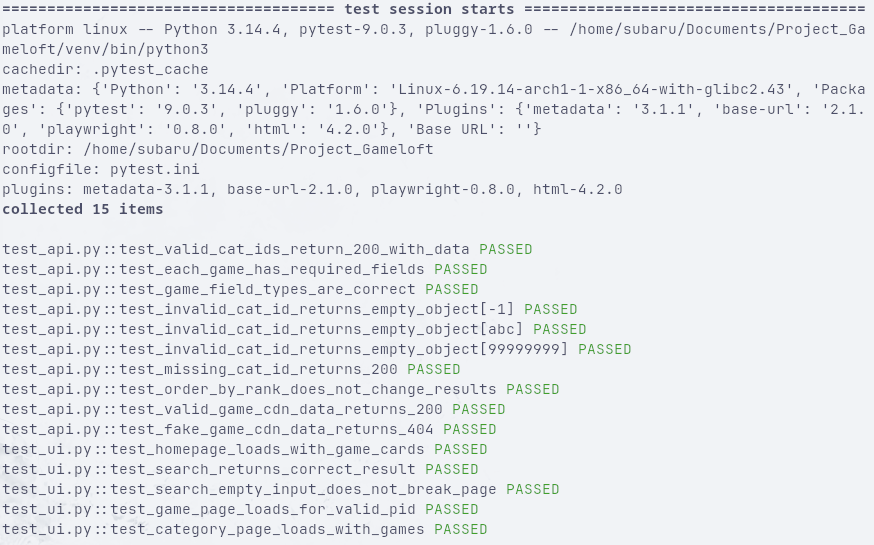

# 🎮 Ludigames QA Automation Suite

Automated test suite for [play.ludigames.com](https://play.ludigames.com) — built as part of the Gameloft QA Automation & AI Internship application challenge.

---

## 🚀 Setup & Run

### 1. Clone the repository
```bash
git clone https://github.com/edysojog/ludigames-qa-report.git
cd ludigames-qa-report
```

### 2. Install dependencies
```bash
pip install -r requirements.txt
```

### 3. Install Playwright browsers
```bash
playwright install chromium
```

### 4. Run all tests
```bash
pytest
```

### 5. Run only API or UI tests (extra)
```bash
pytest tests/test_api.py
pytest tests/test_ui.py
```

A full HTML report is generated at `report.html` after each run.

---

## 👤 Findings & Observations

Before running any tests, I put myself in the mindset of a regular user and asked: *what should always work so that the experience isn't disturbed?*

User experience is the most important part of a website — if a user cannot access something they need, or can access something that shouldn't be public, there would be a significant problem.

Here are a few observations I noted while browsing:

> **A popup appears on every visit**
> The cookie popup appears every time you load the website. Until you accept the cookie conditions, you cannot do anything. If this popup ever fails to load correctly, the user cannot access anything.

> **The search bar is hidden**
> If the user doesn't correlate the magnifying glass icon with the search function, they cannot search for any game. A better approach would be a direct search bar in the navbar, so no confusion can ever be made.

> **Game pages load with an ad covering the screen**
> The same principle as the first observation. If the ad popup ever fails, the games aren't accessible.

> **Not all games have the same information**
> Some game cards show the icon and the name below, others show only the icon. This inconsistency makes the website feel unpolished.

> **Manage cookie policy link**
> The link to the cookie policy is formatted in a way that makes it hard to see. This could confuse a user.

---

## 🔍 How I Explored the Site

Before writing any tests, I spent time manually exploring play.ludigames.com with **browser DevTools open** (Network tab, XHR filter). This revealed:

- The main API endpoint: `/ludiapi/gamelist.php?cat_id=...&orderByRank=`
- The CDN pattern for game assets: `cdn.ludigames.com/h5/{product_key}/data.json`
- URL patterns for game pages (`game.html?pID=`) and category pages (`category.html?catId=`)
- That search is client-side — no separate search API endpoint exists
- That `orderByRank=true` and `orderByRank=` return identical results

This research-first approach ensured every test is grounded in real observed behavior.

---

## 🧪 Test Scenarios

### API Tests (`tests/test_api.py`)

Here is a short explanation of every API test, what it does and why it matters.

#### TC-API-01
**Test:** Valid category IDs return HTTP 200 with non-empty JSON

**Why?** Core homepage API — if it breaks, no games are shown to anyone.

#### TC-API-02
**Test:** Each game object contains all required fields

**Why?** Missing fields silently break game card rendering on the frontend.

#### TC-API-03
**Test:** `product_id` is always int, `isPortrait` is always bool

**Why?** Type mismatches cause silent bugs — wrong types break URL generation and layout logic.

#### TC-API-04
**Test:** Invalid `cat_id` values (`-1`, `abc`, `99999999`) return `{}`

**Why?** The API should handle bad input gracefully, not crash with a 500 error.

#### TC-API-05
**Test:** Missing `cat_id` parameter returns 200 without crashing

**Why?** Consistent error handling — omitting a parameter should not cause a server error.

#### TC-API-06
**Test:** `orderByRank=true` returns the same results as `orderByRank=`

**Why?** Documents discovered behavior — any future change to this would be caught immediately.

#### TC-API-07
**Test:** Valid game key returns HTTP 200 from CDN

**Why?** Each game page depends on this CDN call to load — if it fails, the game won't start.

#### TC-API-08
**Test:** Non-existent game key returns HTTP 404 from CDN

**Why?** The CDN should not serve wrong data for missing resources.

---

### UI Tests (`tests/test_ui.py`)

Here is a short explanation of every UI test, what it does and why it matters.

#### TC-UI-01
**Test:** Homepage loads with game cards visible

**Why?** The most basic user expectation — the portal must show games on arrival.

#### TC-UI-02
**Test:** Search for "pixelcraft" returns "PixelCraft Parkour"

**Why?** Search is the primary game discovery feature — wrong results destroy trust.

#### TC-UI-03
**Test:** Empty search input does not break the page

**Why?** Edge case — users often click and clear the search bar without typing.

#### TC-UI-04
**Test:** Game page loads for a valid `pID`

**Why?** Every game card links here — a blank game page means users can't play.

#### TC-UI-05
**Test:** Category page loads and displays game cards

**Why?** Category browsing is the main way users discover new games.

---

## 📸 Test Results




---

## 🛠 Tech Stack

- **Python 3.x**
- **pytest** — test runner
- **Playwright** — browser automation for UI tests
- **requests** — HTTP client for API tests
- **pytest-html** — generates an HTML test report
